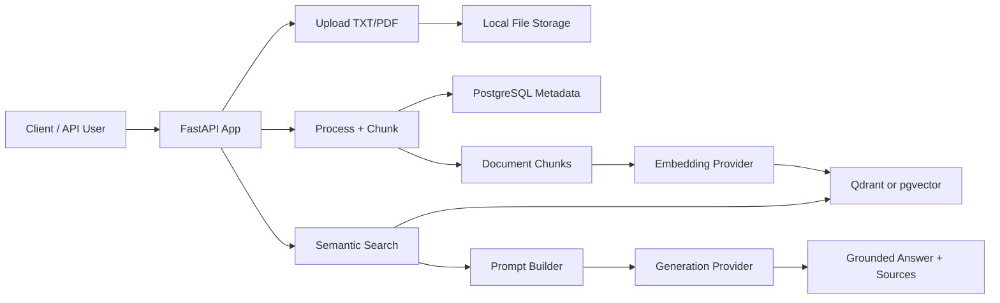

# Mini RAG

<div align="center">

**A compact FastAPI backend for document ingestion, vector search, and Retrieval-Augmented Generation.**

[](https://www.python.org/)
[](https://fastapi.tiangolo.com/)
[](https://github.com/pgvector/pgvector)
[](https://qdrant.tech/)
[](https://www.langchain.com/)
[](https://platform.openai.com/)

</div>

---

## What Is Mini RAG?

Mini RAG is a small but complete RAG backend. It lets you upload documents, split them into chunks, generate embeddings, store vectors, search semantically, and generate grounded answers using an LLM.

It is designed as a learning-friendly and hackable project: the codebase is compact, provider-based, and easy to extend with new chunking, retrieval, and generation strategies.

## Highlights

- **FastAPI API** for upload, processing, indexing, search, and RAG answers.
- **TXT and PDF ingestion** using LangChain loaders and PyMuPDF.
- **Configurable chunking** with recursive, simple, and semantic chunking hooks.
- **Vector search** with Qdrant or PostgreSQL pgvector.
- **LLM providers** for OpenAI and Cohere, with OpenAI-compatible local model support.
- **Source-aware answers** with retrieval scores, metadata, and citation-friendly output.
- **Prompt budget controls** to keep answer generation cheaper and more predictable.
- **Project isolation** using `project_id` for files, chunks, and vector collections.
- **Async database layer** using SQLAlchemy async and asyncpg.
- **Docker support** for MongoDB and PostgreSQL pgvector services.

## Architecture



## RAG Pipeline

```text
Upload file
  -> validate type and size
  -> save file locally
  -> create asset record
  -> load TXT/PDF content
  -> split content into chunks
  -> save chunks and metadata
  -> embed chunks
  -> index vectors
  -> search by query embedding
  -> build bounded prompt context
  -> generate answer with citations
```

## Tech Stack

| Layer | Technology |
|---|---|
| API | FastAPI, Uvicorn |
| Database | PostgreSQL, SQLAlchemy async, asyncpg |
| Vector Stores | Qdrant, pgvector |
| Document Loading | LangChain, PyMuPDF |
| LLM Providers | OpenAI, Cohere, OpenAI-compatible local APIs |
| Configuration | pydantic-settings, `.env` |
| Migrations | Alembic |
| Containers | Docker Compose |

## Quick Start

### 1. Clone the repository

```bash
git clone https://github.com/YOUR_USERNAME/mini_RAG.git
cd mini_RAG
```

### 2. Start database services

```bash
cd docker
docker-compose up -d
```

The compose file includes:

- MongoDB on `27017`
- PostgreSQL pgvector on host port `5433`

### 3. Install Python dependencies

```bash
cd ../src
pip install -r requirments.txt
```

> Note: the dependency file is intentionally named `requirments.txt` in this repo.

### 4. Configure environment

Create `src/.env` from the example:

```bash
copy .env.example .env
```

On macOS/Linux:

```bash
cp .env.example .env
```

Important settings:

```env
POSTGRES_USERNAME="postgres"
POSTGRES_PASSWORD="your_password"
POSTGRES_HOST="localhost"
POSTGRES_PORT=5433
POSTGRES_MAIN_DATABASE="postgres"

GENERATION_BACKEND="OPENAI"
EMBEDDING_BACKEND="OPENAI"
OPENAI_API_KEY="your_api_key"

GENERATION_MODEL_ID="gpt-4o-mini"
EMBEDDING_MODEL_ID="text-embedding-3-small"
EMBEDDING_MODEL_SIZE=1536

VECTOR_DB_BACKEND="PGVECTOR"
VECTOR_DB_DISTANCE_METHOD="cosine"
VECTOR_DB_INDEX_TYPE="IVFFLAT"

RETRIEVAL_TOP_K=10
ANSWER_TOP_K=5
RETRIEVAL_SCORE_THRESHOLD=0.0
MAX_CONTEXT_CHARS=6000
```

### 5. Run migrations

```bash
cd models/db_schemas/mini_rag
alembic upgrade head
```

### 6. Start the API

```bash
cd ../../../
uvicorn main:app --reload
```

Open:

- API: `http://localhost:8000`
- Swagger UI: `http://localhost:8000/docs`

## API Usage

### Health Check

```bash
curl http://localhost:8000/api/v1/
```

### Upload a File

```bash
curl -X POST "http://localhost:8000/api/v1/data/upload/1" \
  -F "file=@example.pdf"
```

### Process File Into Chunks

```bash
curl -X POST "http://localhost:8000/api/v1/data/process/1" \
  -H "Content-Type: application/json" \
  -d '{
    "chunck_size": 500,
    "overlap_size": 50,
    "do_reset": 1,
    "chunking_method": "recursive"
  }'
```

Supported `chunking_method` values:

| Method | Description |
|---|---|
| `recursive` | Default LangChain recursive splitter |
| `simple` | Lightweight line-based splitter |
| `semantic` | Semantic splitter hook for embedding-aware chunking |

### Index Chunks

```bash
curl -X POST "http://localhost:8000/api/v1/nlp/index/push/1" \
  -H "Content-Type: application/json" \
  -d '{ "do_reset": 1 }'
```

### Search

```bash
curl -X POST "http://localhost:8000/api/v1/nlp/index/search/1" \
  -H "Content-Type: application/json" \
  -d '{
    "text": "What is this document about?",
    "limit": 5,
    "score_threshold": 0.2,
    "include_sources": true
  }'
```

### Ask a RAG Question

```bash
curl -X POST "http://localhost:8000/api/v1/nlp/index/answer/1" \
  -H "Content-Type: application/json" \
  -d '{
    "text": "Summarize the key points.",
    "limit": 5,
    "score_threshold": 0.2,
    "include_sources": true
  }'
```

Example response shape:

```json
{
  "signal": "RAG answer succeed",
  "answer": "The document explains ... [Doc 1]",
  "sources": [
    {
      "doc_num": 1,
      "chunk_id": 12,
      "file_name": "example.pdf",
      "asset_id": 3,
      "chunk_order": 4,
      "score": 0.82,
      "text": "Relevant source snippet..."
    }
  ],
  "full_prompt": "...",
  "chat_history": [...]
}
```

## Configuration Reference

| Variable | Purpose |
|---|---|
| `GENERATION_BACKEND` | LLM provider for answer generation |
| `EMBEDDING_BACKEND` | LLM provider for embeddings |
| `GENERATION_MODEL_ID` | Chat/generation model name |
| `EMBEDDING_MODEL_ID` | Embedding model name |
| `EMBEDDING_MODEL_SIZE` | Vector dimension used by the embedding model |
| `VECTOR_DB_BACKEND` | `QDRANT` or `PGVECTOR` |
| `VECTOR_DB_DISTANCE_METHOD` | `cosine`, `dot`, or `euclidean` |
| `VECTOR_DB_INDEX_TYPE` | pgvector index type: `HNSW` or `IVFFLAT` |
| `RETRIEVAL_TOP_K` | Internal candidate count for retrieval |
| `ANSWER_TOP_K` | Default number of chunks used for answering |
| `RETRIEVAL_SCORE_THRESHOLD` | Minimum similarity score for retrieved chunks |
| `MAX_CONTEXT_CHARS` | Maximum context size sent to the generation model |
| `DEFAULT_LANGUAGE` | Prompt template locale |

## Project Structure

```text
mini_RAG/
├── docker/
│   └── docker-compose.yml
├── docs/
│   └── enhancement-plan.md
├── src/
│   ├── main.py
│   ├── requirments.txt
│   ├── controllers/
│   ├── helpers/
│   ├── models/
│   ├── routes/
│   ├── stores/
│   │   ├── llm/
│   │   ├── templates/
│   │   └── vectordb/
│   └── assets/
├── AGENTS.md
├── ENHANCEMENTS.md
├── RAG_EFFICIENCY_ENHANCEMENTS.md
└── README.md
```

## Provider Design

Mini RAG uses factory classes so providers can be swapped through configuration:

- `LLMProviderFactory` creates generation and embedding clients.
- `VectorDBProviderFactory` creates Qdrant or pgvector clients.
- `Template_Parser` loads localized prompt templates.

This makes it straightforward to add new providers without changing route logic.

## Roadmap

- [x] TXT and PDF upload
- [x] Recursive and simple chunking
- [x] Semantic chunking hook
- [x] PostgreSQL metadata storage
- [x] Qdrant vector store
- [x] pgvector vector store
- [x] Semantic search
- [x] RAG answer generation
- [x] Source-aware answer responses
- [x] Score threshold support
- [x] Prompt context budgeting
- [ ] Agentic chunking
- [ ] Embedding cache
- [ ] MMR retrieval
- [ ] Hybrid keyword + vector search
- [ ] Query expansion
- [ ] Reranking
- [ ] Streaming answers
- [ ] Web UI playground

## Notes

- `src/.env` is the runtime configuration file loaded by the app.
- Uploaded files are stored under `src/assets/files/`.
- Qdrant can run embedded from `VECTOR_DB_PATH`.
- pgvector uses the PostgreSQL service from Docker Compose.
- The codebase intentionally keeps some existing names such as `ProccesController` and `chunck_size` for compatibility.

## License

MIT
