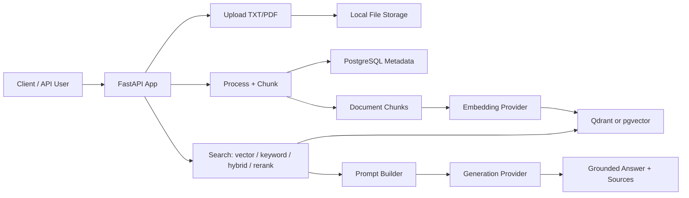

# Mini RAG

<div align="center">

**A compact FastAPI backend for document ingestion, vector search, and Retrieval-Augmented Generation — benchmarked against a golden-labeled clinical dataset.**

[](https://www.python.org/)
[](https://fastapi.tiangolo.com/)
[](https://github.com/pgvector/pgvector)
[](https://qdrant.tech/)
[](https://www.langchain.com/)
[](https://platform.openai.com/)

</div>

---

## What Is Mini RAG?

Mini RAG is a small but complete RAG backend. It lets you upload documents, split them into chunks, generate embeddings, store vectors, search semantically, and generate grounded answers using an LLM.

It is designed as a learning-friendly and hackable project: the codebase is compact, provider-based, and easy to extend with new chunking, retrieval, and generation strategies.

## Highlights

- **FastAPI API** for upload, processing, indexing, search, and RAG answers.
- **TXT and PDF ingestion** using LangChain loaders and PyMuPDF.
- **Configurable chunking** with recursive, simple, and semantic chunking hooks.
- **Vector search** with Qdrant or PostgreSQL pgvector.
- **4 retrieval modes** — `vector`, `keyword`, `hybrid` (RRF fusion), and `rerank` (Cohere cross-encoder).
- **LLM providers** for OpenAI and Cohere, with OpenAI-compatible local model support.
- **Source-aware answers** with retrieval scores, metadata, and citation-friendly output.
- **Prompt budget controls** to keep answer generation cheaper and more predictable.
- **Project isolation** using `project_id` for files, chunks, and vector collections.
- **Async database layer** using SQLAlchemy async and asyncpg.
- **Golden-labeled retrieval eval harness** in `scripts/eval_retrieval.py`.
- **Medical safety guardrail** that refuses personal-symptom queries.

## Architecture



## RAG Pipeline

```text
Upload file
  -> validate type and size
  -> save file locally
  -> create asset record
  -> load TXT/PDF content
  -> split content into chunks
  -> save chunks and metadata
  -> embed chunks
  -> index vectors
  -> search by query embedding
  -> build bounded prompt context
  -> generate answer with citations
```

## Tech Stack

| Layer | Technology |
|---|---|
| API | FastAPI, Uvicorn |
| Database | PostgreSQL, SQLAlchemy async, asyncpg |
| Vector Stores | Qdrant, pgvector |
| Document Loading | LangChain, PyMuPDF |
| LLM Providers | OpenAI, Cohere, OpenAI-compatible local APIs |
| Configuration | pydantic-settings, `.env` |
| Migrations | Alembic |
| Containers | Docker Compose |
| Eval | `scripts/eval_retrieval.py` + `eval/clinical_questions.json` |

## Quick Start

> All commands in this section run from `src/` (the app uses flat imports such as `from helpers.config import ...`).

### 1. Start database services

```bash
cd docker
# create docker/.env with POSTGRES_PASSWORD first (NOT in docker/.env.example)
docker-compose up -d
```

The compose file includes PostgreSQL pgvector on host port `5433`.

### 2. Install Python dependencies

```bash
cd ../src
pip install -r requirments.txt
```

> Note: the dependency file is intentionally named `requirments.txt` in this repo — do not rename it.

### 3. Configure environment

```bash
copy .env.example .env
```

Important settings:

```env
POSTGRES_USERNAME="postgres"
POSTGRES_PASSWORD="your_password"
POSTGRES_HOST="localhost"
POSTGRES_PORT=5433
POSTGRES_MAIN_DATABASE="postgres"

GENERATION_BACKEND="OPENAI"
EMBEDDING_BACKEND="OPENAI"
OPENAI_API_KEY="your_api_key"

GENERATION_MODEL_ID="gpt-4o-mini"
EMBEDDING_MODEL_ID="text-embedding-3-small"
EMBEDDING_MODEL_SIZE=1536

VECTOR_DB_BACKEND="PGVECTOR"
VECTOR_DB_DISTANCE_METHOD="cosine"
VECTOR_DB_INDEX_TYPE="IVFFLAT"

RETRIEVAL_TOP_K=10
ANSWER_TOP_K=8
RETRIEVAL_SCORE_THRESHOLD=0.0
MAX_CONTEXT_CHARS=12000
```

### 4. Run migrations

```bash
cd models/db_schemas/mini_rag
copy alembic.ini.example alembic.ini   # alembic.ini is gitignored
alembic upgrade head
cd ../../..
```

Hard DB reset: `python reset_db.py` (drops tables + `vector` extension), then `alembic upgrade head`.

### 5. Start the API

```bash
uvicorn main:app --reload
```

Open:

- API: `http://localhost:8000`
- Swagger UI: `http://localhost:8000/docs`

## Ingestion (one-time per document)

1. **Upload** — `POST /api/v1/data/upload/{project_id}` with `file=@doc.pdf`.
2. **Process** — `POST /api/v1/data/process/{project_id}` chunks the file.
3. **Index** — `POST /api/v1/nlp/index/push/{project_id}` embeds and stores vectors.

## API Usage

### Health Check

```bash
curl http://localhost:8000/api/v1/
```

### Search

```bash
curl -X POST "http://localhost:8000/api/v1/nlp/index/search/1" \
  -H "Content-Type: application/json" \
  -d '{
    "text": "What is the initial treatment for newly diagnosed asthma?",
    "limit": 5,
    "retrieval_mode": "hybrid",
    "rerank": true
  }'
```

`retrieval_mode` accepts `vector`, `keyword`, `hybrid`, or `rerank`. Set `rerank: true` to re-score the candidate list with the Cohere cross-encoder.

### Ask a RAG Question

```bash
curl -X POST "http://localhost:8000/api/v1/nlp/index/answer/1" \
  -H "Content-Type: application/json" \
  -d '{
    "text": "How does GINA recommend confirming an asthma diagnosis?",
    "limit": 8,
    "retrieval_mode": "hybrid",
    "rerank": true
  }'
```

Example response shape:

```json
{
  "signal": "RAG answer succeed",
  "answer": "The document explains ... [Doc 1]",
  "sources": [
    {
      "doc_num": 1,
      "chunk_id": 12,
      "file_name": "GINA_2026_Strategy_Report.pdf",
      "asset_id": 3,
      "chunk_order": 4,
      "page_number": 82,
      "score": 0.82,
      "text": "Relevant source snippet..."
    }
  ],
  "full_prompt": "...",
  "chat_history": [...]
}
```

## Evaluation

The repo ships a golden-labeled retrieval harness: 20 hand-authored clinical questions over the asthma guideline dataset (`NICE NG80`, `GINA 2026`, `NHLBI QRG`), each with expected **document hint + page window + content keywords**.

### The relevance rule

A retrieved chunk counts as a hit when it matches **any** golden entry:

- `document_name` contains the `doc_hint` (case-insensitive), **and**
- `page_number` is within `[page_from - 2, page_to + 2]`, **and**
- the chunk text contains at least one golden `keyword` (case-insensitive).

### Steps to run the eval

```bash
# 1. Make sure the server is running and a project is fully ingested
#    (upload -> process -> index). This repo's eval uses project_id 1.

# 2. From src/, run the harness:
python ../scripts/eval_retrieval.py --project-id 1

# 3. Optional: restrict modes and top-K values
python ../scripts/eval_retrieval.py --project-id 1 --modes vector hybrid rerank --top-k 3 5

# 4. Optional: point at a non-default server
python ../scripts/eval_retrieval.py --project-id 1 --base-url http://localhost:8000
```

The run takes ~15 minutes (20 questions x 4 modes x 3 K values = 240 search calls) and writes a timestamped report to `eval/results_<YYYYMMDD_HHMMSS>.md` containing:

- a per-question table of `P@K` and hit/miss for every mode x K,
- a summary of mean `P@K` and **hit rate** per mode per K,
- a "failure modes" list of every question/mode/K that failed to retrieve a golden chunk.

### Metrics

- **P@K** — fraction of the top-K results that are relevant.
- **Hit rate** — fraction of questions where at least one relevant chunk appears in the top-K (i.e. "recall-at-K" per question).

### Current baseline (20 questions, 8/11/2026)

| mode | @3 hit | @5 hit | @10 hit | P@3 | P@10 |
|---|---|---|---|---|---|
| **rerank** | **0.90** | **0.95** | 0.95 | **0.367** | 0.165 |
| **hybrid** | 0.60 | 0.80 | **1.00** | 0.217 | 0.155 |
| vector | 0.65 | 0.75 | 0.80 | 0.217 | 0.135 |
| keyword | 0.50 | 0.70 | 0.80 | 0.167 | 0.135 |

Takeaways:

- **rerank** is the strongest mode at small K — use it when the top few chunks must be right.
- **hybrid** is the only mode that reaches 1.00 hit rate at K=10.
- Known weak spots: `q11` (obesity — keyword and rerank miss; the rerank candidate pool is keyword-based), `q08` (MART — vector miss), `q02` (vector-only miss).

## Configuration Reference

| Variable | Purpose |
|---|---|
| `GENERATION_BACKEND` | LLM provider for answer generation |
| `EMBEDDING_BACKEND` | LLM provider for embeddings |
| `GENERATION_MODEL_ID` | Chat/generation model name |
| `EMBEDDING_MODEL_ID` | Embedding model name |
| `EMBEDDING_MODEL_SIZE` | Vector dimension used by the embedding model |
| `VECTOR_DB_BACKEND` | `QDRANT` or `PGVECTOR` |
| `VECTOR_DB_DISTANCE_METHOD` | `cosine`, `dot`, or `euclidean` |
| `VECTOR_DB_INDEX_TYPE` | pgvector index type: `HNSW` or `IVFFLAT` |
| `RETRIEVAL_TOP_K` | Internal candidate count for retrieval |
| `ANSWER_TOP_K` | Default number of chunks used for answering |
| `RETRIEVAL_SCORE_THRESHOLD` | Minimum similarity score for retrieved chunks |
| `MAX_CONTEXT_CHARS` | Maximum context size sent to the generation model |
| `DEFAULT_LANGUAGE` | Prompt template locale |

## Project Structure

```text
mini_RAG/
├── docker/                    # docker-compose (PostgreSQL pgvector)
├── Dataset/                   # source guideline PDFs
├── docs/
│   └── enhancement-plan.md    # roadmap + eval results
├── eval/
│   ├── clinical_questions.json   # golden-labeled eval set
│   └── results_*.md             # generated eval reports
├── scripts/
│   └── eval_retrieval.py         # retrieval eval harness
├── src/
│   ├── main.py
│   ├── requirments.txt        # intentionally misspelled
│   ├── .env                   # gitignored runtime config
│   ├── controllers/
│   ├── helpers/
│   ├── models/
│   ├── routes/
│   ├── stores/
│   │   ├── llm/
│   │   ├── templates/
│   │   └── vectordb/
│   └── assets/files/
├── AGENTS.md
├── README.md
└── Requirements.md
```

## Provider Design

Mini RAG uses factory classes so providers can be swapped through configuration:

- `LLMProviderFactory` creates generation and embedding clients.
- `VectorDBProviderFactory` creates Qdrant or pgvector clients.
- `Template_Parser` loads localized prompt templates (`en/`, `ar/`).

This makes it straightforward to add new providers without changing route logic.

## Roadmap

- [x] TXT and PDF upload
- [x] Recursive and simple chunking
- [x] Semantic chunking hook
- [x] PostgreSQL metadata storage
- [x] Qdrant vector store
- [x] pgvector vector store
- [x] Hybrid keyword + vector search (RRF fusion)
- [x] Cross-encoder reranking (Cohere `rerank-v3.5`)
- [x] Golden-labeled retrieval evaluation harness
- [x] Medical safety guardrail
- [x] RAG answer generation with source citations
- [x] Prompt context budgeting
- [ ] Agentic chunking
- [ ] Embedding cache
- [ ] MMR retrieval
- [ ] Query expansion (would fix q11 keyword/rerank miss)
- [ ] Streaming answers
- [ ] Web UI playground

## Notes

- `src/.env` is the runtime configuration file loaded by the app; the app will not start without it.
- `EMBEDDING_MODEL_SIZE` must match the embedding provider (e.g. `text-embedding-3-small` = 1536). Changing it orphans existing collections.
- Uploaded files are stored under `src/assets/files/{project_id}/`.
- The codebase intentionally keeps some existing names such as `ProccesController` and `chunck_size` for compatibility — do not rename.
- `do_reset=1` on process/index wipes that project's vector collection and chunk rows.
- CORS only allows `http://localhost:8080` and only `POST`.

## License

MIT
