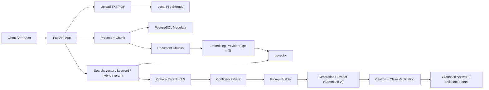

# Mini RAG — Clinical Asthma Q&A

<div align="center">

**A safety-first RAG backend for evidence-grounded clinical asthma questions — built on GINA 2026, NICE NG80, and NHLBI guidelines, with multi-layer guardrails and a golden-labeled benchmark.**

[](https://www.python.org/)
[](https://fastapi.tiangolo.com/)
[](https://github.com/pgvector/pgvector)
[](https://cohere.com/rerank)
[](https://ollama.com/)
[](#unit-tests)

</div>

---

## Overview

Mini RAG is a FastAPI RAG backend purpose-built for **clinical asthma questions**. It ingests guideline PDFs (GINA, NICE, NHLBI), chunks and embeds them into a pgvector store, and generates grounded, citation-backed answers to clinical questions — while refusing personal-symptom, out-of-scope, and emergency queries at the safety layer.

The system is benchmarked against a 20-question golden-labeled retrieval set and a 30-case answer quality harness, with both automated eval scripts in the repo.

## Key Results

| Metric | Score | Target | Status |
|---|---|---|---|
| Hit Rate@5 (rerank) | **0.900** | ≥0.90 | ✅ |
| Hit Rate@10 (rerank) | **1.000** | ≥0.95 | ✅ |
| Refusal Accuracy | **1.000** | =1.00 | ✅ |
| Citation Faithfulness | **1.000** | ≥0.95 | ✅ |
| Safety Classifier Accuracy | **1.000** | =1.00 | ✅ |
| Unsupported Claim Rate | **0.000** | =0.00 | ✅ |
| Unit Tests Passing | **42/42** | 100% | ✅ |
| Precision@3 (rerank) | 0.333 | ≥0.40 | ⚠️ |
| Precision@5 (rerank) | 0.260 | ≥0.30 | ⚠️ |

Full benchmark dashboard: `eval/benchmark_dashboard_FINAL_20260814.md`

---

## Architecture



### Safety Layers

| Layer | What it does | Target |
|---|---|---|
| **Risk Classifier** | Refuses emergency/personal/out-of-scope queries | 1.00 accuracy |
| **Confidence Gate** | Blocks generation when evidence score/count too low | 100% refusals on weak evidence |
| **Citation Verifier** | Validates each `[Doc, p. N]` against source chunks | 1.00 faithfulness |
| **Unsupported Claim Detector** | Flags numeric claims absent from evidence | 0.00 unsupported rate |
| **Language Fidelity** | Arabic queries get Arabic answers | 1.00 fidelity |

### Retrieval Modes

| Mode | P@3 | P@5 | HitRate@5 | HitRate@10 |
|---|---|---|---|---|
| **rerank** (hybrid + Cohere) | **0.333** | **0.260** | **0.900** | **1.000** |
| hybrid (vector + BM25 RRF) | 0.283 | 0.220 | 0.900 | 1.000 |
| keyword (BM25) | 0.217 | 0.200 | 0.700 | 0.850 |
| vector (bge-m3) | 0.217 | 0.150 | 0.600 | 0.750 |

---

## Tech Stack

| Layer | Technology |
|---|---|
| API | FastAPI + Uvicorn |
| Database | PostgreSQL + pgvector (Docker) |
| Embeddings | `bge-m3` (1024-dim) via Ollama |
| Reranker | Cohere `rerank-v3.5` |
| LLM | `command-a-03-2025` via Ollama |
| Vector Store | pgvector (IVFFLAT index) |
| Config | pydantic-settings, `.env` |
| Migrations | Alembic |
| Eval | Custom harnesses (`eval_retrieval_v2.py`, `eval_answers.py`) |
| Tests | pytest (42 unit tests) |

---

## Quick Start

> All commands run from `src/` — the app uses flat imports (`from helpers.config import ...`).

### 1. Start Postgres

```bash
cd docker
# create docker/.env with POSTGRES_PASSWORD
docker-compose up -d
```

Host port: `5433`.

### 2. Install dependencies

```bash
cd src
pip install -r requirments.txt
```

### 3. Configure

```bash
copy .env.example .env
```

Key settings:

```env
EMBEDDING_MODEL_ID="bge-m3"
EMBEDDING_MODEL_SIZE=1024
GENERATION_MODEL_ID="command-a-03-2025"
VECTOR_DB_BACKEND="PGVECTOR"
RETRIEVAL_TOP_K=25
RERANK_TOP_K=20
HYBRID_RRF_K=30
ANSWER_MIN_TOP_SCORE=0.45
ANSWER_MIN_EVIDENCE_COUNT=1
```

### 4. Migrate

```bash
cd models/db_schemas/mini_rag
copy alembic.ini.example alembic.ini
alembic upgrade head
cd ../../..
```

Hard reset: `python reset_db.py` then `alembic upgrade head`.

### 5. Run

```bash
uvicorn main:app --reload
```

Swagger: `http://localhost:8000/docs`

### 6. Ingest documents

```bash
# Upload
curl -X POST http://localhost:8000/api/v1/data/upload/1 \
  -F "file=@Dataset/GINA_2026.pdf"

# Process (chunk)
curl -X POST http://localhost:8000/api/v1/data/process/1

# Index (embed + store)
curl -X POST http://localhost:8000/api/v1/nlp/index/push/1
```

### 7. Ask a question

```bash
curl -X POST http://localhost:8000/api/v1/nlp/index/answer/1 \
  -H "Content-Type: application/json" \
  -d '{"text": "What is the preferred controller at Step 1?", "limit": 8, "retrieval_mode": "hybrid", "rerank": true}'
```

---

## Evaluation

### Retrieval (22 questions, 4 modes × 3 K values)

```bash
python ../scripts/eval_retrieval_v2.py --project-id 1
# → eval/results_<timestamp>.md
```

20 clinical questions + 2 true-negatives. Relevance rule: doc hint in `document_name` AND `page_number` within ±2 of golden window AND any golden keyword in chunk text.

### Answer quality (30 cases)

```bash
python ../scripts/eval_answers.py --project-id 1
# → eval/answer_results_<timestamp>.md
```

Covers: direct clinical, multi-chunk, patient-specific, refusal (emergency/personal/out-of-scope/pet), ambiguous, adversarial injection, language fidelity, instruction override resistance.

### Golden label audit

```bash
python scripts/audit_golden_labels.py
# prints every golden entry vs DB chunk; flags mismatches
```

---

## Unit Tests

```bash
pytest tests/test_core.py -v
```

42 tests across 6 classes:

| Class | Tests | What it covers |
|---|---|---|
| TestSafetyClassifier | 16 | Emergency, personal dosing, out-of-scope, pets, programming, Arabic |
| TestConfidenceGate | 7 | High/medium/low/insufficient confidence, score thresholds, non-official docs |
| TestCitationVerification | 5 | Single, multi, unsupported, combined-bracket splitting, no-citation |
| TestQueryExpansion | 10 | MART, SABA, GINA, NICE, NHLBI, step-down, non-pharmacological, exacerbation |
| TestUnsupportedClaims | 2 | Supported vs unsupported numeric claims |
| TestAnswerQuality | 2 | Empty answer, cited answer faithfulness |

---

## Safety Configuration

Risk rules are hot-reloadable from `src/config/safety_config.json` — no code changes needed to add patterns. The classifier evaluates rules in order; first match wins.

Risk levels: `refuse_redirect` → `needs_caution` → `allowed`.

Refusal reasons: `possible_emergency`, `personal_medication_advice`, `animal_or_pet_question`, `clearly_non_clinical`, `empty_query`.

---

## Project Structure

```
RAG_AI_Hackathon/
├── docker/                          # PostgreSQL pgvector (Docker Compose)
├── Dataset/                         # Source guideline PDFs
├── eval/
│   ├── clinical_questions_v2.json   # 22 golden-labeled retrieval questions
│   ├── answer_cases_v2.json         # 30 answer quality test cases
│   ├── benchmark_dashboard_FINAL_*.md
│   ├── results_*.md                 # Retrieval eval reports
│   └── answer_results_*.md          # Answer eval reports
├── scripts/
│   ├── eval_retrieval_v2.py         # Retrieval eval harness
│   ├── eval_answers.py              # Answer quality eval harness
│   └── audit_golden_labels.py       # Golden label audit tool
├── src/
│   ├── main.py
│   ├── requirments.txt              # intentionally misspelled
│   ├── .env                         # gitignored runtime config
│   ├── controllers/
│   │   └── NLPController.py         # Core: search, expand, rerank, verify, answer
│   ├── routes/
│   ├── models/
│   ├── helpers/
│   │   └── safety_config.py         # Hot-reloadable risk rules
│   ├── stores/
│   │   ├── llm/                     # OpenAI, Cohere, Ollama
│   │   ├── rerank/                  # Cohere rerank-v3.5
│   │   ├── vectordb/                # pgvector, Qdrant
│   │   └── templates/               # Prompt templates (en, ar)
│   ├── config/
│   │   └── safety_config.json       # Risk rules, refusals
│   ├── tests/
│   │   └── test_core.py             # 42 unit tests
│   └── assets/files/{project_id}/
├── AGENTS.md
└── README.md
```

---

## Configuration Reference

| Variable | Default | Purpose |
|---|---|---|
| `EMBEDDING_MODEL_ID` | `bge-m3` | Embedding model name |
| `EMBEDDING_MODEL_SIZE` | `1024` | Vector dimension (must match model) |
| `GENERATION_MODEL_ID` | `command-a-03-2025` | LLM via Ollama |
| `VECTOR_DB_BACKEND` | `PGVECTOR` | Vector store backend |
| `RETRIEVAL_TOP_K` | `25` | Pre-rerank candidate pool size |
| `RERANK_TOP_K` | `20` | Post-rerank selection count |
| `HYBRID_RRF_K` | `30` | Reciprocal rank fusion constant |
| `ANSWER_MIN_TOP_SCORE` | `0.45` | Minimum top-score to allow generation |
| `ANSWER_MIN_EVIDENCE_COUNT` | `1` | Minimum official evidence chunks |
| `ANSWER_TOP_K` | `8` | Chunks used in generation prompt |
| `MAX_CONTEXT_CHARS` | `12000` | Prompt context budget |

---

## Notes

- `src/.env` is gitignored; the app will not start without it.
- `EMBEDDING_MODEL_SIZE` must match the embedding model; changing it orphans existing collections.
- Intentional typos kept for API compatibility: `requirments.txt`, `ProccesController`, `chunck_size`.
- `do_reset=1` on process/index wipes that project's vector collection and chunks.
- CORS allows any `localhost` port (regex-based). Frontend served from any port works.
- `src/.env` changes require a manual server restart (code changes auto-reload).

## License

MIT
