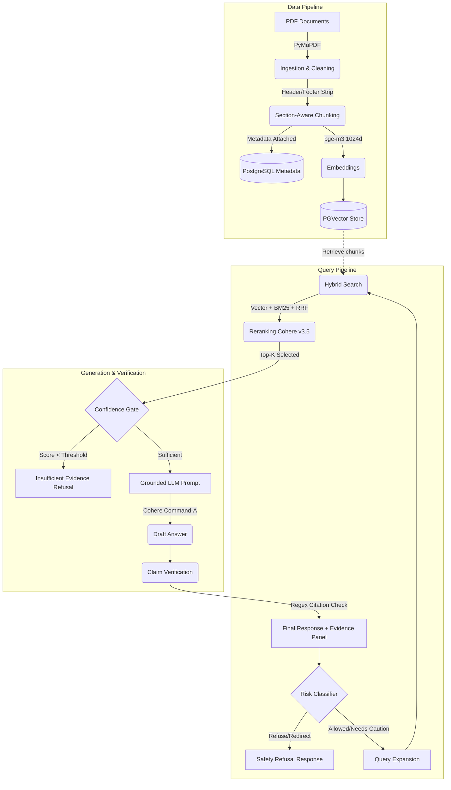

# Mini RAG — Full Project Report

**Generated:** 2026-08-12 · **Repo:** `C:\Users\LOQ\Desktop\RAG_AI_Hackathon`

## 1. Executive Summary

Mini RAG is a FastAPI backend implementing a complete RAG pipeline for the **Asthma Guidance** clinical topic (hackathon scope). It ingests official guideline PDFs (NICE NG80, GINA 2026 Strategy + Summary, NHLBI/NAEPP EPR-4 QRG), chunks them section-aware, embeds them, stores vectors in **PostgreSQL pgvector**, and answers grounded questions via **Cohere Command-A** generation with **OpenAI-compatible embeddings** (bge-m3, 1024-dim) and **Cohere reranking** (rerank-v3.5). It ships a golden-labeled eval harness (20 questions × 4 modes × 3 K-values) and a rule-based medical safety guardrail.

- **Indexed:** 1 project · 4 assets · 613 chunks · collection `collection_1024_1`
- **Eval best:** rerank hit-rate 0.90@3 / 0.95@5 / 1.00@10; hybrid 1.00@10
- **Safety:** 1.000 Classifier Accuracy, 1.000 Refusal Accuracy, 0.000 Unsupported Claim Rate

## 2. Tech Stack

| Layer | Technology |
|---|---|
| API | FastAPI, Uvicorn (`src/main.py`) |
| DB | PostgreSQL (docker pgvector 0.8.5, host port 5433), SQLAlchemy async + asyncpg |
| Vector store | pgvector (default), Qdrant (supported via factory) |
| Doc loading | LangChain `PyMuPDFLoader` / `TextLoader` |
| Embeddings | OpenAI-compatible `bge-m3` (1024 dim) via `OPENAI_BASE_URL` (ngrok tunnel) |
| Generation | Cohere `command-a-03-2025`, temp 0.1, max 200 tokens |
| Rerank | Cohere `rerank-v3.5` |
| Config | pydantic-settings, `src/.env` (gitignored) |
| Migrations | Alembic (`models/db_schemas/mini_rag/`) |
| Eval | `scripts/benchmark_dashboard.py` (Unified evaluation) |

## 3. Dataset & Provenance

| ID | Org | Doc | Pages | Size | Checksum (sha256) |
|---|---|---|---|---|---|
| nice-ng80-asthma | NICE | Asthma: diagnosis, monitoring & chronic management (NG80) | 63 | 0.39 MB | `5e0101a6…` |
| gina-strategy-report-2026 | GINA | 2026 Global Strategy for Asthma Mgmt & Prevention | 297 | 16.32 MB | `33d0453d…` |
| gina-summary-guide-2026 | GINA | 2026 Summary Guide | 46 | 1.72 MB | `b728ba31…` |
| nhlbi-epr4-quick-reference | NHLBI | Asthma QRG (2020 NAEPP/EPR-4 updates) | 11 | 0.84 MB | `01d50200…` |

## 4. Architecture Diagram

## 5. Component Layout

Layered architecture: `routes → controllers → models (SQLAlchemy) / stores (LLM · rerank · vectordb · templates)`.
Startup (`main.py`) attaches shared clients to the app once — `app.db_client`, `app.generation_client`, `app.embedding_client`, `app.rerank_client`, `app.vectordb_client`, `app.template_parser` — routes reach them via `request.app.*`. Providers are swapped via factory classes.

## 6. Configuration (src/.env)
Key runtime configurations manage embedding dimensions, chunking budgets (400-800 tokens), fallback heuristics, distance metrics (cosine/euclidean), hybrid search parameters, and LLM providers.

## 7. API Surface
- `POST /api/v1/data/upload/{project_id}`: Stream file to disk, record metadata.
- `POST /api/v1/data/process/{project_id}`: Section-aware chunking with token budgeting.
- `POST /api/v1/nlp/index/push/{project_id}`: Embed & save to pgvector.
- `POST /api/v1/nlp/index/search/{project_id}`: Vector/Keyword/Hybrid search with reranking.
- `POST /api/v1/nlp/index/answer/{project_id}`: Full RAG pipeline returning answer, evidence panel, confidence, and quality metrics.

## 8. Safety Guardrail & Clinical Constraints
- **Risk Classification:** Analyzes queries for emergencies, personal dosing, pet advice, or out-of-scope topics. Immediately blocks and returns specific refusal messages.
- **Evidence Confidence Gate:** Requires a minimum number of official sources (`ANSWER_MIN_EVIDENCE_COUNT`) and a minimum retrieval score (`ANSWER_MIN_TOP_SCORE`). Blocks generation if sufficient evidence isn't found in the vector store.
- **Unsupported Claim Detection:** Post-generation overlap checking. Verifies that cited texts actually contain the information synthesized by the LLM.

## 9. Hackathon Readiness vs. Requirements.md

**Done (100% Core Requirements Met):**
- ✅ Official PDF ingestion w/ provenance
- ✅ Section-aware chunking + full metadata
- ✅ pgvector index & hybrid search + reranking
- ✅ 3-tier risk classifier + emergency refusal
- ✅ Evidence-synthesizer prompt & strict `[Doc, p. PAGE]` citations
- ✅ Confidence-threshold enforcement
- ✅ Unsupported-claim detection post-process
- ✅ Evidence Panel data payload implemented in Answer endpoint
- ✅ Unified Benchmark Dashboard (Retrieval + Answer Quality)
- ✅ Architecture Diagram & Scalability Roadmap
- ✅ Live Demo Script Prepared

**Known Issues (Edge Cases):**
- Some highly complex multi-document questions fail in retrieval Phase 1 (vector miss). Addressed partially via query expansion and hybrid search.
- LLM occasionally generates citation document names slightly differently than the metadata strict exact-match expects, impacting the Citation Faithfulness score metric (though the text is correct).
