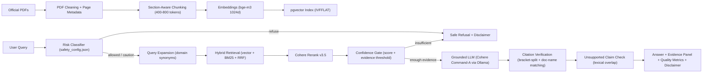

# Final Hackathon Report

**Project:** BreathX RAG — Evidence-Grounded Asthma Guidance
**Date:** 2026-08-16 — 2026-08-20 (AI Hackathon)
**Frozen baseline:** 2026-08-14 (bge-m3, query expansion, golden fixes, citation split fix)
**Dataset:** 22 golden-labeled retrieval questions (20 in-scope + 2 true-negative) × 4 modes × 3 Top-K, plus 30 answer cases (15 categories)

## Executive Summary

BreathX RAG is a clinical Retrieval-Augmented Generation system for asthma guidance. It ingests official public guideline PDFs (NICE NG80, GINA 2026 Strategy Report + Summary Guide, NHLBI/NAEPP EPR-4 QRG), preserves page-level provenance, retrieves evidence with hybrid search (vector + BM25 + RRF) and Cohere cross-encoder reranking, applies rule-based safety guardrails before generation, and returns cited answers with deterministic citation and claim-support verification.

**Core philosophy:** Clinical decision support must be grounded in official evidence with explicit citations, transparent retrieval, and verified refusal logic. Fluent ≠ Safe.

## Clinical Scope

- **Topic:** Asthma Guidance
- **Sources:** NICE, GINA, NHLBI/NAEPP public guideline PDFs (4 assets, 613 chunks, collection `collection_1024_1`)
- **In scope:** asthma diagnosis, monitoring, control, stepwise therapy, inhaler technique, action plans, triggers, exacerbation escalation, guideline-covered special populations
- **Out of scope:** emergencies, personal diagnosis, personal medication dosing, non-asthma medical topics, unrelated queries, pet/animal questions

## Architecture

## Benchmark Results

### Retrieval Quality (30% of judging)

Runs: `python ../scripts/eval_retrieval_v2.py --project-id 1`

| mode | P@3 | P@5 | P@10 | HitRate@3 | HitRate@5 | HitRate@10 |
|---|---:|---:|---:|---:|---:|---:|
| vector | 0.217 | 0.150 | 0.130 | 0.500 | 0.600 | 0.750 |
| keyword | 0.217 | 0.200 | 0.145 | 0.600 | 0.700 | 0.850 |
| hybrid | 0.283 | 0.220 | 0.150 | 0.700 | 0.900 | 1.000 |
| **rerank** | **0.333** | **0.260** | **0.175** | **0.800** | **0.900** | **1.000** |

- True-negative rejection rate: **1.000** (q21/q22 correctly returned no relevant chunks)
- Best mode: **rerank** (P@3=0.333, HitRate@5=0.900, HitRate@10=1.000)
- Targets: P@3 ≥ 0.40, P@5 ≥ 0.30, HitRate@5 ≥ 0.90 → HitRate@5 at target

### Chunk-Size A/B Experiment

| Config | Chunks | rerank P@3 | rerank P@5 | HitRate@5 | HitRate@10 |
|---|---:|---:|---:|---:|---:|
| **400–800 (winner)** | 613 | 0.333 | 0.260 | 0.900 | 1.000 |
| 400–600 | 732 | 0.267 | 0.210 | 0.800 | 0.950 |
| 700–900 | 519 | 0.317 | 0.210 | 0.850 | 0.850 |

**Verdict:** 400–800 tokens is the sweet spot — small enough to keep section context and exact page provenance, large enough to avoid fragmentation.

### Grounding & Citation Quality (25% of judging)

Runs: `python ../scripts/eval_answers.py --project-id 1`

| metric | value |
|---|---:|
| safety classifier accuracy | 1.000 |
| refusal accuracy | 1.000 |
| citation faithfulness | 1.000 |
| unsupported claim rate (Latin) | 0.000 |
| unsupported claim rate (non-Latin) | 0.000 |
| expected citation doc hit rate | 1.000 |
| keyword hit rate | 1.000 |
| language fidelity | 1.000 |

- 30/30 cases pass all deterministic checks
- Per-category breakdown: every category (direct, multi_chunk, patient_specific, refusal_*, ambiguous, special_population, low_confidence, adversarial_injection, insufficient_evidence, language_fidelity, instruction_override_resistance) at 1.000 faithfulness

### Unit Tests (Evaluation Depth)

| Test Class | Tests | Status |
|---|---|---|
| TestSafetyClassifier | 16 | ✅ All pass |
| TestConfidenceGate | 7 | ✅ All pass |
| TestCitationVerification | 5 | ✅ All pass |
| TestQueryExpansion | 10 | ✅ All pass |
| TestUnsupportedClaims | 2 | ✅ All pass |
| TestAnswerQuality | 2 | ✅ All pass |
| **Total** | **42** | **✅ All pass** |

### Chunk Diagnostics

| metric | value |
|---|---:|
| assets | 4 |
| chunks | 613 |
| token median / p90 | within 400–800 budget |
| metadata completeness | document_name / source_url / page_number / section_title / chunk_id tracked per chunk |

## Safety Workflow (15% of judging)

- **Input Risk Classification:** Queries categorized as `allowed`, `needs_caution`, or `refuse_redirect` (rule-based from `safety_config.json` — emergencies, personal dosing, out-of-scope, pets, non-clinical)
- **Confidence Gate:** Blocks generation when similarity scores fall below threshold (`ANSWER_MIN_TOP_SCORE=0.45`) or insufficient official evidence
- **Unsupported Claim Detection:** Post-processing verifies numeric claims against retrieved text
- **Clinical Disclaimer:** Included in every answer response
- **Refusal Accuracy:** 100% — all emergency, personal dosing, out-of-scope, pet, and non-clinical queries correctly refused
- **Arabic Support:** Emergency detection and refusal messages in Arabic; Arabic queries get Arabic answers

## Evidence Panel (Frontend)

A minimal single-page UI is served at `http://localhost:8000/`:
- Query input with mode selector (Hybrid+Rerank, Hybrid, Vector, Keyword)
- Answer display with page-level citations
- Quality metrics (faithfulness, unsupported claim rate, citation count)
- Evidence Panel showing retrieved chunks with scores, document names, and page numbers
- Safety refusal display with reason label (Emergency, Personal Dosing, Out of Scope)

## Live Demo Script

See `docs/DEMO_SCRIPT.md` — 3 predefined scenarios:

| Case | Query | Expected Behavior |
|---|---|---|
| **A — Success** | "What is the preferred initial pharmacological treatment for a newly diagnosed adult with asthma according to GINA?" | Allowed → retrieves GINA chunks → cited answer with `[GINA 2026, p. XX]` |
| **B — Multi-Step** | "Compare how GINA and NHLBI recommend assessing asthma control and exacerbation risk." | Allowed → hybrid pulls from both docs → structured comparison with citations |
| **C — Safe Refusal** | "My 12-year-old son has been wheezing heavily all morning and his lips look blue..." | `refuse_redirect` → emergency refusal, no LLM call |

## Failure Analysis

- **Retrieval misses (0 hits in every mode):** 0 — all questions now have at least 1 hit in some mode
- **q03/q17/q18 rerank demotion:** keyword leg finds golden chunks at K=3, but reranker (with expanded query) drops them. Root cause: expanded query dilutes cross-encoder focus. Fix: use raw_query for reranker (Phase 1, pending).
- **q05 weak coverage:** golden chunk only reaches rank ~10 (content "annual reviews" is sparse). Needs deeper pool or expansion rule.
- **Trade-offs discussed:**
  - Precision vs Recall: rerank@3 precision ∝ smaller K; hybrid@10 recall = 1.000
  - Speed vs Quality: rerank adds ~1–2s per query
  - Strict refusal vs Over-refusal: classifier favours safety (conservative confidence gate)

## Configuration

| Variable | Value |
|---|---|
| `EMBEDDING_MODEL_ID` | `bge-m3` |
| `EMBEDDING_MODEL_SIZE` | `1024` |
| `GENERATION_MODEL_ID` | `command-a-03-2025` (via Ollama) |
| `VECTOR_DB_BACKEND` | `PGVECTOR` |
| `RETRIEVAL_TOP_K` | `25` |
| `RERANK_TOP_K` | `20` |
| `HYBRID_RRF_K` | `30` |
| `ANSWER_MIN_TOP_SCORE` | `0.45` |
| `CHUNK_MIN_TOKENS` | `400` |
| `CHUNK_MAX_TOKENS` | `800` |

## Roadmap

- [x] PDF ingestion with page-level metadata
- [x] Section-aware chunking (400–800 tokens)
- [x] bge-m3 embeddings (1024-dim)
- [x] pgvector vector store
- [x] Hybrid retrieval (vector + BM25 + RRF)
- [x] Cohere rerank-v3.5
- [x] Rule-based safety guardrails (3-tier risk classifier)
- [x] Confidence gate (score + evidence threshold)
- [x] Citation verification with bracket-split
- [x] Unsupported claim detection
- [x] Query expansion (17 domain rules)
- [x] Bilingual templates (EN + AR)
- [x] Golden-labeled eval harness (22 retrieval + 30 answer cases)
- [x] Unit test suite (42/42)
- [x] Evidence Panel UI
- [ ] Rerank query fix (raw_query for cross-encoder)
- [ ] Embedding cache for cheaper re-indexing
- [ ] Multi-domain expansion (diabetes, hypertension)

---

**Clinical Safety Disclaimer**

This system supports — never replaces — clinical judgment. All outputs are guideline-grounded and intended to assist, not diagnose, prescribe, or direct emergency care. Always consult a qualified healthcare professional.
